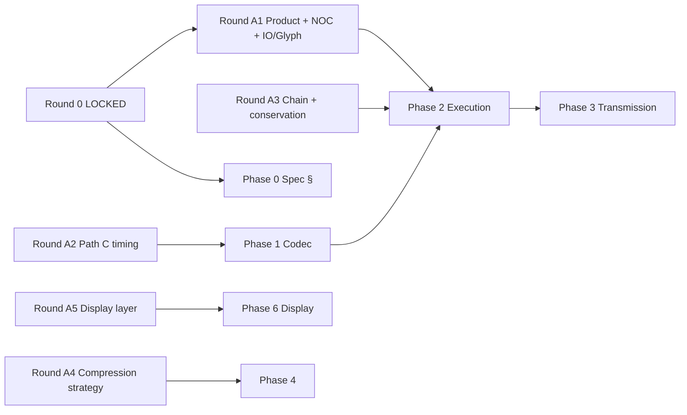

# Architecture alignment roadmap (Track A)
_Execution view. 2026-05-24. Normative phase definitions: [`Workpads — Architectural Roadmap.md`](../../../../research/Main%20Glyph%20&%20Group%20Ref%20Docs/Workpads%20—%20Architectural%20Roadmap.md) (Document A). Locked charter: [`JUNCTION-DECISIONS-LOCKED.md`](JUNCTION-DECISIONS-LOCKED.md)._

---

## How this relates to kaios phases

| Plan | Scope |
|---|---|
| `DEVELOPMENT-PLAN.md` A–M | v0.2 **ship** — largely complete |
| **This file** | v0.3+ **architecture** — research → standard → codec → kaios |
| `JUNCTION-WORKPLAN.md` | Co-planning rounds and gates |

Track S (Phase L store) runs **in parallel** per Round 0 lock.

---

## Phase 0 — Spec confirmation (now)

**Goal:** No silent drift between research, Path C spec, and live `#1pa/` codec.

| Workstream | Actions | Owner |
|---|---|---|
| **Corpus** | Confirm Documents 3–13 + A by **section number** | Stakeholder |
| **Index** | Update status column in Document Index after each doc | Agent |
| **Open items** | Register in `OPEN-QUESTIONS.md` (OQ-42+) | Agent |
| **Path C open** | Resolve C-Q01–C-Q05 in A2 (not Phase 0 bulk) | Round A2 |

**Exit:** Load-bearing sections for Phases 1–2 have no **Decided vs Open** conflict (Doc 3 §8, Doc 4 conservation, Doc 6 partial ack minimum).

**Parallel:** Round A1 (product/glyph/NOC) does not require full Phase 0 complete — but NOC wire answers depend on Doc 3/4 confirmation.

---

## Phase 1 — Codec integrity + Path C header

**Goal:** Wire carries type-at-byte-0, integrity, chain semantics; Path C adopted on new scheme tag.

| Item | Research | Standard/kaios | Round |
|---|---|---|---|
| Flag byte + CRC-16 | Doc 3 §8.3–8.4 | SUI → `codec.md` | A2 |
| Path C C1–C6 | Path C Full Adoption | New scheme tag + FRAME-SPEC | A2 |
| `chainRef` relationship enum | Doc 8 §3 | `chain-protocol.md` | A3 |
| `changedMask`, `_ratifiedFrame` | Doc 8 §3–4 | kaios share + chain screens | A3 |
| Conformance CI | Doc 9 §4.2 | `workpads-codec` + kaios tests | Post-port |

**Pre-phase bugs (anytime):** camelCase/snake_case sub-records, VAT enum, scheme labels, finance currency — Doc A §3.

**Exit:** Chained amendment round-trip with CRC; relationship type on wire.

**Gate:** A2 locked + SUI drafted — **no Path C coding before**.

---

## Phase 2 — Execution model + conservation

**Goal:** Bilateral meaning, action list, obligation surfacing match Docs 4 and 6.

| Item | Doc | UI |
|---|---|---|
| Action list confirmation | 6 §4 | Receive flow — A1 Q-set |
| Partial confirmation ack | 6 §6 | Wire + ack record |
| Flow vs observation | 4 §2 | Record create / flags |
| Pending conservation | 4 §4.2, §6.4 | List badge + glyph — A1 |
| Obligation-bearing flag | 4 §4.2 | Open chains list |
| Scaled integers | 4 §5 | Wizard + codec (large) |
| Encoder balance check | 4 §6.1 | Encode-time validation |

**Exit:** Invoice share → action list on receive; pending payment visible until chain closes.

**Gate:** A3 locked.

---

## Phase 3 — Transmission optimisation

**Goal:** Single-SMS reliability; QR first-class (Doc 5).

| Item | Notes |
|---|---|
| Share size budget warning | Small UI |
| Binary QR `1dq/` | OQ from Doc 5 §8.1 — confirm in Phase 0 |
| Template QR `1dt/` | Market vendor scenario |
| Native split `1df/` | Medium effort |
| NFC | KaiOS capability dependent |

**Exit:** Routine invoice in one SMS; template QR demo.

**Depends:** Phase 1 stable encode size (Path C helps).

---

## Phase 4 — Relational compression

**Goal:** Tokens, profiles, micro-ledgers (Docs 7, 11, 12, 13).

| Item | v0.3 vs defer |
|---|---|
| `generic.v1` + `service_work.v1` profiles | A4 decides |
| Symbol table + TABLE_ENTRY_ADD | Likely v0.4+ |
| Relational mode flag + uint24 chain refs | A4 decides |
| BlockRegistry → symbol table migration | A4 decides |

**Exit:** 10th exchange with same customer measurably smaller than 1st.

**Gate:** A4 locked (implementation may be roadmap-only for v0.3).

---

## Phase 5 — Identity + governance

Device identity token, optional signing, published test vectors, domain steward process (Docs 9, 10, 13).

**Typically after Phase 4 strategy.**

---

## Phase 6 — Display layer (glyph + cards)

**Goal:** Decode surface matches protocol — not a parallel product.

| Item | Research | Gate |
|---|---|---|
| Three-face render | Doc 6 §5, Glyph Layer | A5 |
| Chain spine in list | Glyph Commentary §4.8 | A5 |
| I/O bilateral layout | Doc 4 + Glyph Lab §4.8 | A1 + A5 |
| Card HTML → KaiOS CSS | `card-screen-types/` | A5 |

**May start mock renders in parallel with Phase 1** using fixture records.

**Depends:** A1 product surface lock; Phase 2 for pending conservation truth.

---

## Co-planning round map

| Round | Deliverable | Unblocks |
|---|---|---|
| 0 | `JUNCTION-DECISIONS-LOCKED.md` | A1, A2, Phase 0 |
| A1 | `PRODUCT-SURFACE-LOCKED.md` | NOC implementation, Phase 6 scope |
| A2 | `CODEC-V2-SCOPE-LOCKED.md` | Phase 1 coding |
| A3 | `CHAIN-EXECUTION-LOCKED.md` | Phase 2 coding |
| A4 | `COMPRESSION-ROADMAP-LOCKED.md` | Phase 4 schedule |
| A5 | `DISPLAY-LAYER-LOCKED.md` | Phase 6 coding |

---

## Compression status (reference)

| Level | Status |
|---|---|
| 1–4 zlib, binary fields, flags, `#1pa/` domain bytes | **Live** in `codec.js` |
| 5–8 dictionary, relational, symbol sync, profiles | **Spec only** — Phase 4 |
| Path C header | **Adopted, not integrated** — Phase 1 via A2 |

---

## Maintenance

When a phase item ships: update Document Index status, Doc A §7, `FEATURES.md`, and close OQ rows.

---

_End._
