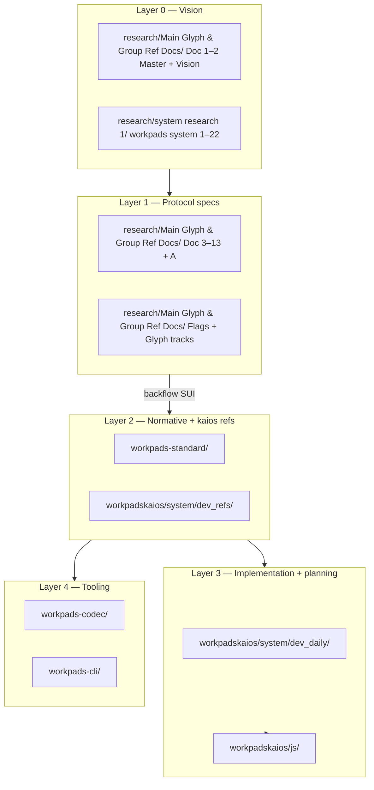

# Junction Work Plan — Research → Standard → KaiOS
_Living plan. 2026-05-24. Read after [`project-process.md`](../project-process.md)._

---

> **Where we are.** v0.2 KaiOS app is **functionally far along** (phases A–I complete; store packaging in progress). A **parallel architecture corpus** lives in [`research/Main Glyph & Group Ref Docs/`](../../../../research/Main%20Glyph%20&%20Group%20Ref%20Docs/) (Documents 1–13 + glyph/flags tracks). The junction is: **stop treating research and implementation as separate worlds** — route decisions through the existing `system/` bottleneck, then code only when a round produces locked answers.
>
> **Round 0 locked:** [`JUNCTION-DECISIONS-LOCKED.md`](JUNCTION-DECISIONS-LOCKED.md) — Track A full roadmap; IO/glyph reconcile via questions; Path C adopted (timing via A2); NOC review before expand; Track S parallel.

> **What this file is.** The work plan for the next stretch: co-planning rounds, web research, doc reconciliation, then gated coding. It does not replace `DEVELOPMENT-PLAN.md`, `OPEN-QUESTIONS.md`, or `research/…/Architectural Roadmap.md` — it **orchestrates** them.

---

# 1. Re-affirmed governance (do not bypass)

These remain mandatory. The documentation sprawl is real; the **process is already designed to handle it**.

| Priority | Document | Role |
|---|---|---|
| **1 — Every session** | [`project-process.md`](../project-process.md) | Single bottleneck: authority matrix, change classes, verification |
| **2 — Every session** | [`DEVELOPMENT-PLAN.md`](DEVELOPMENT-PLAN.md) | Phase audit A–M; what is shipped vs partial |
| **3 — Before coding** | [`FEATURES.md`](FEATURES.md) | What exists in `js/` today |
| **4 — Before codec** | [`FRAME-SPEC.md`](../dev_refs/FRAME-SPEC.md) + [`CODEC-SYNC.md`](CODEC-SYNC.md) | Wire truth for kaios |
| **5 — Before codec (normative)** | [`workpads-standard/codec.md`](../../../workpads-standard/codec.md) | Standard wins on bits |
| **6 — Open design** | [`OPEN-QUESTIONS.md`](OPEN-QUESTIONS.md) | OQ registry — research items enter here |
| **7 — UI track** | [`UI-ROADMAP-STATUS.md`](UI-ROADMAP-STATUS.md) + [`IO-DECISIONS-LOCKED.md`](IO-DECISIONS-LOCKED.md) | IO/sale/nav decisions already locked |
| **8 — Deviations** | [`DEVIATIONS.md`](DEVIATIONS.md) | Any app ≠ standard |
| **9 — Sessions** | [`CODING-LOG.md`](CODING-LOG.md) | Continuity after coding starts |

**Agent/human entry:** `workpadskaios/AGENTS.md` → `system/project-process.md`.

**Rule:** New insight from `research/` does not become code until it passes **§6 insight backflow** in `project-process.md` (draft_spec → SUI → standard → codec → kaios).

---

# 2. Documentation topology (four layers)

Use this map so nothing is read in the wrong order.



## 2.1 Layer 0 — Vision & research corpus

| Location | Contents | Use when |
|---|---|---|
| [`research/Main Glyph & Group Ref Docs/`](/Users/mp/Documents/Vaults/babb/research/Main%20Glyph%20&%20Group%20Ref%20Docs/) | **Documents 1–13, A, Index**; flags; glyphs; card prototypes | Architecture decisions; "why" and "what must be true" |
| [`Workpads — Document Index.md`](/Users/mp/Documents/Vaults/babb/research/Main%20Glyph%20&%20Group%20Ref%20Docs/Workpads%20—%20Document%20Index.md) | Map of all topic docs | Finding the right spec section |
| [`research/system research 1/`](/Users/mp/Documents/Vaults/babb/research/system%20research%201/) | Raw `workpads system 1–22`, `Workpads as New System` | Historical rationale only — superseded by Master Synthesis |
| [`research/card-screen-types/`](/Users/mp/Documents/Vaults/babb/research/card-screen-types/) | HTML/CSS UI prototypes | Visual implementation reference |

**Not authoritative for wire format** until backflowed to `workpads-standard`.

## 2.2 Layer 1 — Protocol & display specs (research, pending confirmation)

| Track | Key files | Status |
|---|---|---|
| **Core protocol** | Doc 3 Record · Doc 4 Conservation · Doc 5 Transmission · Doc 6 Action List · Doc 8 Chain · Doc 9 Governance · Doc 10 Identity · Doc 11 Symbol sync · Doc 12 Micro-ledgers · Doc 13 Domain profiles | Written 2026-05-24; **pending your section confirmations** |
| **Implementation order** | Doc A Architectural Roadmap | Phases 0–6 — aligns with but does not replace kaios phases |
| **Codec header** | Group Flags * · Path C Full Adoption | Analysis done; **not in live codec** |
| **Display** | Glyph Layer · Glyph Lab · Glyph Commentary · Card & Screen Types | **Zero wire bytes**; Phase 6 in Doc A |

## 2.3 Layer 2 — Normative standard + frozen kaios refs

| Location | Authority for |
|---|---|
| `workpads-standard/codec.md` | Wire format (wins over `record-schema.md` if conflict) |
| `workpads-standard/codec-sync.md` | Cross-repo sync checklist |
| `workpads-standard/STANDARD-UPDATES.md` | SUI register — what standard owes kaios |
| `workpads-standard/chain-protocol.md`, `financial-block.md`, … | Published extensions |
| `workpadskaios/system/dev_refs/FRAME-SPEC.md` | KaiOS pads-v1 frame (must agree with codec.md) |
| `workpadskaios/system/dev_refs/STANDARD-FIELDS.md`, `ROLE-CODEBOOK.md`, `TAG-REFERENCE.md` | Field/bit truth for coders |

## 2.4 Layer 3 — KaiOS planning & code

| Location | Authority for |
|---|---|
| `dev_daily/DEVELOPMENT-PLAN.md` | Phases A–M |
| `dev_daily/ROADMAP.md`, `BACKLOG.md` | Version targets |
| `dev_daily/UI-ROADMAP-*`, `IO-DECISIONS-LOCKED.md` | UI/product locked 2026-05-21 |
| `dev_refs/PLATFORM.md`, `WIRING-PATTERNS.md`, `JS-RUNTIME-MAP.md` | How to write app code |
| `js/lib/codec.js` | **Runtime truth** (~1646 lines; superset of npm package) |

## 2.5 Layer 4 — Tooling

| Repo | Role |
|---|---|
| `workpads-codec` | npm package; CLI interop; `flow.test.js` |
| `workpads-cli` | Round-trip harness |

---

# 3. The junction problem (honest)

Three timelines collided:

| Timeline | State |
|---|---|
| **v0.2 ship path** | Phases A–I done; L (store PNG) blocking; IO UI largely done per `UI-ROADMAP-STATUS` |
| **FRAME-SPEC / pads-v1** | 14 codec rounds complete; `#1pa/` live; Path C header **specified but not merged** |
| **v02 architecture** | Documents 3–13 describe flag byte, relational mode, symbol tables, action list protocol, conservation — **mostly not in app** |

**Risk if we ignore the junction:** Code against research docs directly → drift from `FRAME-SPEC` and no SUI trail. Code only v0.2 ship items → architecture docs rot.

**Resolution:** Split work into **Track S (Ship)** and **Track A (Architecture alignment)** with explicit gates. Track S can continue in parallel where it does not contradict locked architecture.

---

# 4. Two tracks

## Track S — Ship v0.2 (existing plan)

**Goal:** KaiOS store-ready package.

| Item | Doc | Gate |
|---|---|---|
| Phase L — PNG icons, device verify | `DEVELOPMENT-PLAN` | No architecture round required |
| Pre-ship bugs | `IMPLEMENTATION.md`, phase audit | camelCase/snake_case, VAT enum, scheme labels |
| Optional J/K | `FEATURES.md` | User priority call |

**Coding allowed immediately** for Track S items.

## Track A — Architecture alignment (new)

**Goal:** Turn `research/Main Glyph & Group Ref Docs/` into a **bounded v0.3 / pads-v2 plan** that feeds standard → codec → kaios in order. Full phase map: [`ARCHITECTURE-ALIGNMENT-ROADMAP.md`](ARCHITECTURE-ALIGNMENT-ROADMAP.md).

**Coding gated** until Round A4 completes (see §5).

| Doc A phase | KaiOS / standard action |
|---|---|
| Phase 0 | Confirm research docs § by § |
| Phase 1 | Path C + flag byte + CRC → SUI → codec.md amendment |
| Phase 2 | Chain relationship enum + action list + conservation UI |
| Phase 3 | Transmission (SMS/QR/NFC) — Doc 5 |
| Phase 4 | Relational compression (profiles, symbol tables) |
| Phase 5 | Identity + governance |
| Phase 6 | Display / glyph / cards |

---

# 5. Co-planning rounds (before intensive coding)

Each round ends with a **locked decisions file** in `dev_daily/` and updates to `OPEN-QUESTIONS.md`. Web research is explicit per round.

---

## Round 0 — Junction charter — **COMPLETE**

**Deliverable:** [`JUNCTION-DECISIONS-LOCKED.md`](JUNCTION-DECISIONS-LOCKED.md)

---

## Round A1 — Product surface, IO/glyph, NOC — **COMPLETE**

**Deliverable:** [`PRODUCT-SURFACE-LOCKED.md`](PRODUCT-SURFACE-LOCKED.md)

## Round A2 — Path C — **COMPLETE**

**Deliverable:** [`CODEC-V2-SCOPE-LOCKED.md`](CODEC-V2-SCOPE-LOCKED.md) — tag `#1pv/`

## Round A3 — Chain, conservation & execution — **COMPLETE**

**Deliverable:** [`CHAIN-EXECUTION-LOCKED.md`](CHAIN-EXECUTION-LOCKED.md) — **G2 gate met** (A2 + A3)

## Round A4 — Compression strategy — **COMPLETE** (signed off 2026-05-24)

**Deliverable:** [`COMPRESSION-ROADMAP-LOCKED.md`](COMPRESSION-ROADMAP-LOCKED.md)

## Phase 0 + codec port — **IN PROGRESS**

| Step | Doc |
|---|---|
| P0 confirm | [`PHASE-0-CONFIRMATION-TRACKER.md`](PHASE-0-CONFIRMATION-TRACKER.md) — **P0 ☑** |
| Local link testing | [`link-lab/`](../../link-lab/) — `npm run link-lab` |
| Wire addendum | [`dev_refs/FRAME-SPEC-1pv-ADDENDUM.md`](../dev_refs/FRAME-SPEC-1pv-ADDENDUM.md) |
| Implementation order | [`CODEC-PORT-CHECKLIST.md`](CODEC-PORT-CHECKLIST.md) |

**Priority questions (answer NOC-01 first):**

1. Need/Offer/Connection **model** (wire types vs Outcome+flags vs UI-only) — see NOC review § Approach options
2. IO vs glyph layout authority — see G-01–G-18
3. Action confirmation screen — dedicated screen or modal on receive?
4. Open obligations list — home, list filter, or panel strip?
5. Customer-facing share: Face 1 only, or same card with hidden zones?

**Web research topics:**

- KaiOS 3.x feature phone UX patterns (D-pad forms, list density)
- Comparable offline-first receipt/invoice apps (UX only, not tech stack)

---

## Round A2 — Codec & wire format (Path C timing + scope)

**Adoption:** yes (Round 0). **Questionnaire:** [`ROUND-A2-PATH-C-INTEGRATION.md`](ROUND-A2-PATH-C-INTEGRATION.md).

**Read:** Path C Full Adoption, Group Flags Bit Analysis, FRAME-SPEC, `codec.md`, Doc 3 §7–8, Doc 9.

**Deliverable:** `CODEC-V2-SCOPE-LOCKED.md` + SUI rows in `STANDARD-UPDATES.md`

**Web research topics:**

- SMS segment reliability by region (Doc 5) — validate single-SMS target
- QR binary mode capacity benchmarks (already in Doc 5 — verify with current libraries)

---

## Round A3 — Chain, conservation & execution (Docs 4, 6, 8)

**Read:** Doc 4, 6, 8; `chain-protocol.md`; `agreements.js` (deferred off shell); UI lifecycle strip.

**Deliverable:** `CHAIN-EXECUTION-LOCKED.md` — relationship enum values, obligation flag, pending conservation UX.

**Questions:**

1. `chainRef` + relationship type on wire — minimum enum set for v0.3?
2. Partial confirmation — bitmask width (Doc 6 §8.2)?
3. Pending conservation — list badge, chain screen, or both?
4. Dispute/amendment flows — extend existing screens or new chain spine UI?
5. Ratification / state_commit — wire `_ratifiedFrame` now (IMPLEMENTATION gap)?

**Web research:** Optional — ISO 20022 / simple B2B ack patterns (concepts only, not adoption).

---

## Round A4 — Compression & profiles (Docs 7, 11, 12, 13) — strategic

**Read:** Doc 7, 11, 12, 13; Doc A Phase 4; BlockRegistry (current local contacts).

**Deliverable:** `COMPRESSION-ROADMAP-LOCKED.md` — what ships in v0.3 vs v0.4 vs horizon.

**Questions:**

1. Ship relational mode in v0.3 at all, or v0.4 only?
2. First domain profile: `service_work.v1` only, or + `produce.v1`?
3. Symbol table sync — inline in record stream vs dedicated `1ds/` messages first?
4. BlockRegistry → relationship symbol table migration path?
5. Delta records — yes/no/defer (Doc 7 §10.2)?

**Web research topics:**

- Symbol table sync protocols in constrained networks (academic/industrial — CRDT dictionary sync, Rsync-style vocab deltas)
- Domain-specific compression precedents (EDI, GS1, UN/CEFACT — concepts for profile design, not format copy)

---

## Round A5 — Display layer (glyph + card system)

**Read:** Glyph Layer, Glyph Commentary, Card & Screen Types, `card-screen-types/`.

**Deliverable:** `DISPLAY-LAYER-LOCKED.md` — registry v1 scope, KaiOS component mapping, Phase 6 entry criteria.

**Questions:**

1. Glyph registry v1 — how many base entries before ship?
2. List row L0 — glyph strip mandatory or optional feature flag?
3. I/O bilateral layout — which record types (flow only)?
4. E-paper / print — in scope for v0.3?
5. Build card HTML prototypes into kaios CSS variables (`workpads-ui.css`) — when?

**Web research:** Unicode coverage on KaiOS 2.x/3.x system fonts (validate Geometric Shapes tier).

---

# 6. Gate to coding (Track A)

**Do not start Track A codec/app work until:**

| # | Criterion |
|---|---|
| G1 | Round 0 complete — `JUNCTION-DECISIONS-LOCKED.md` exists |
| G2 | At least Rounds A2 + A3 locked (codec + chain are coupled) |
| G3 | SUI rows drafted for every wire change |
| G4 | `OPEN-QUESTIONS.md` updated — research open items registered as OQ-42+ |
| G5 | `project-process.md` §7 snapshot refreshed |

**Track S coding** may proceed anytime without G1–G5.

---

# 7. Suggested execution order (after rounds)

```
Week-style sequence (adjust to your pace):

  [Track S parallel]  Phase L store assets + ship bugs

  Round 0  →  Junction decisions
  Round A1 →  Product surface (UI + Doc 6)
  Round A2 →  Codec v2 scope (Path C)
       ↓
  SUI + codec.md + workpads-codec port
  kaios codec.js port + npm test
       ↓
  Round A3 →  Chain + conservation + action list UI
       ↓
  kaios: chain enum, confirmation screen, obligation surfacing
       ↓
  Round A4 →  Compression strategy (may defer implementation)
  Round A5 →  Display layer (parallel HTML → components)
```

---

# 8. Research doc confirmation workflow

For each Document 3–13:

| Step | Action |
|---|---|
| 1 | You confirm, amend, or reject **by section number** (e.g. "Doc 4 §9.2: reject base-10, keep base-2") |
| 2 | Agent moves **Decided** items into `workpads-standard` or `dev_refs` as appropriate |
| 3 | **Open** items → `OPEN-QUESTIONS.md` (OQ-42+) |
| 4 | Update `research/Main Glyph & Group Ref Docs/Workpads — Document Index.md` status column |

Bulk "approve all" is possible but section-by-section is safer for load-bearing decisions (Doc 3 §8 flag byte, Doc 4 conservation, Doc 6 partial ack).

---

# 9. Web research protocol

When a round calls for web research:

1. **State the question** in round deliverable (not open-ended browsing).
2. **Produce 1-page synthesis** appended to round locked file — sources linked.
3. **Extract decisions** — research informs OQ resolution, not new scope by default.
4. **Prefer primary sources** — KaiOS developer docs, Unicode charts, carrier SMS specs; avoid over-indexing on generic ERP UX.

Research outputs live in `dev_daily/research-notes/` (create per round, e.g. `research-notes/A2-sms-qr.md`).

---

# 10. Maintenance

| Event | Update |
|---|---|
| Round completed | Create `*-LOCKED.md`; tick in this file §5 |
| Wire change | `project-process.md` change class + SUI |
| Coding session | `CODING-LOG.md` |
| Research doc amended | Document Index in `research/Main Glyph & Group Ref Docs/` |

**Refresh `project-process.md` §7** after Round 0 and after first codec v2 port.

---

# 11. Links

| Doc | Path |
|---|---|
| This plan | `workpadskaios/system/dev_daily/JUNCTION-WORKPLAN.md` |
| Process bottleneck | `workpadskaios/system/project-process.md` |
| Round 0 lock | `dev_daily/JUNCTION-DECISIONS-LOCKED.md` |
| Track A roadmap | `dev_daily/ARCHITECTURE-ALIGNMENT-ROADMAP.md` |
| A1 IO/glyph questions | `dev_daily/ROUND-A1-IO-GLYPH-RECONCILIATION.md` |
| A1 NOC review | `dev_daily/ROUND-A1-NOC-REVIEW.md` |
| A2 Path C questions | `dev_daily/ROUND-A2-PATH-C-INTEGRATION.md` |
| Research index | `research/Main Glyph & Group Ref Docs/Workpads — Document Index.md` |
| Architecture phases | `research/Main Glyph & Group Ref Docs/Workpads — Architectural Roadmap.md` |
| UI status | `dev_daily/UI-ROADMAP-STATUS.md` |

---

_End. **Phase 0 confirmations complete** (`P2-CONFIRMATIONS-LOCKED.md`). **Next:** link-lab testing board ([`LINK-LAB-PLAN.md`](LINK-LAB-PLAN.md)), template QR + NFC spec/build, `spec-tests/` growth — deploy parked ([`CLOSING-TASKS.md`](CLOSING-TASKS.md))._
