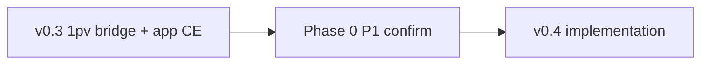

# v0.4 compression — implementation scope (gate doc)
_2026-05-24. Strategic lock: [`COMPRESSION-ROADMAP-LOCKED.md`](COMPRESSION-ROADMAP-LOCKED.md). v0.3 ships Path C bridge only._

**v0.4 native codec train complete in KaiOS** (2026-05-24). P1 Phase 0 **confirmed** — [`P1-CONFIRMATIONS-LOCKED.md`](P1-CONFIRMATIONS-LOCKED.md).

---

## v0.4 deliverables (single release train)

| # | Item | Output | Status |
|---|------|--------|--------|
| V4-1 | Relational mode flag + compact chain refs | `codec.md` §relational; pathc native groups | **Scaffold** — bridge ext; native groups open |
| V4-2 | Symbol table local store | IndexedDB / localStorage vocab | **Scaffold** — `symbol-table.js` |
| V4-3 | Inline TABLE_ENTRY_ADD in record stream | Before dedicated `1ds/` | **Scaffold** — bridge inline blob |
| V4-4 | Domain profile `service_work.v1` | First profile encoder | **Scaffold** — profile id byte |
| V4-5 | BlockRegistry → symbol export | **Done** — `scripts/export-block-registry-symbols.js` |
| V4-6 | Remove v1 embed bridge (DEV-WP-V2-001) | **Done** |
| V4-7 | Success metric harness | **Done** — 33% interim gate in CI test |

---

## Explicitly deferred within v0.4 horizon

- `produce.v1` profile (after service_work validated)  
- Delta records (evaluate after relational round-trip)  
- Dedicated `1ds/` symbol sync URLs (after inline path works)  
- BitPads financial leg (Doc 12 §8)  

---

## Dependencies

---

## P1 confirmation tracker

See [`PHASE-0-CONFIRMATION-TRACKER.md`](PHASE-0-CONFIRMATION-TRACKER.md) § P1 (Docs 7, 11, 12, 13).

---

_End._
