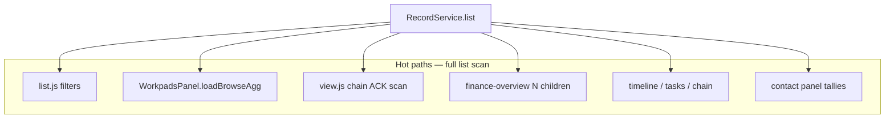

# Full JavaScript examination — workpadskaios

**Date:** 2026-05-21  
**Scope:** Every `.js` file under `js/` (runtime + libs + panels + screens + services), plus test/script inventory.  
**Method:** Read/grep + subagent deep dives + `npm test` (650 pass) + targeted fixes for confirmed bugs.  
**Prior partial audits:** Wave 1–4 (`AUDIT-WAVE-*.md`), `AUDIT-LEDGER.md` — superseded for coverage by this document; wave files remain historical.

---

## Executive summary

| Metric | Value |
|--------|--------|
| Runtime JS files (`js/`) | **48** (excl. `test/`, `scripts/`) |
| `index.html` script tags | **51** (incl. `demo.js`, `browser-dev.js`) |
| Total runtime LOC (approx.) | **~32,600** |
| Largest files | `WorkpadsPanel.js` (2169), `list.js` (1753), `codec.js` (1675), `wizard.js` (1577), `template-creator.js` (1418), `view.js` (1061) |
| Tests | **650 pass** (`codec-pads-v1.test.js`); `flow.test.js` = npm package path |
| Off-shell libs | `agreements.js`, `roles.js`, `formula.js`, `template-registry.js` |

**Architecture (healthy):** Single encode choke (`RecordService.encodeUrl` ← `share.js`). Single decode/receive choke (`app.js` routing → `decodeUrl` / `WPSecurity` → `storeReceived`). Financial truth for summaries: `FinancialModel.summarize`. Child money lines: `ledger.js` + `RecordService.create/save`.

**Top risks found:**

1. **Full-store scans** on hot paths (`RecordService.list()` in view chain, browse agg, finance-overview N×`listChildren`, timeline, tasks, contact panel).
2. **Monolith panels/screens** — `WorkpadsPanel.js`, `wizard.js`, `template-creator.js` duplicate field/category HTML.
3. **Off-shell vs on-shell drift** — docs still say TRIG/C-TRIG off shell; `WPAgreements` / `WPRoles` unused on device.
4. **TRIG display** — not recomputed on `get`/`list` (only decode/store); fixed secure-store path in this audit.
5. **Production pack** — `demo.js` + `browser-dev.js` still in `index.html` (first-run wipe / desktop keys).

**Fixes applied during this audit (650 tests still pass):**

| Fix | File(s) |
|-----|---------|
| `LiabilitiesScreen` registered in `SCREEN_HANDLERS` (D-pad was dead) | `app.js` |
| Clear URL hash after plain + secure record receive (avoid double-import on reload) | `app.js` |
| `applyTrigPresentation` in `storeReceived` (secure `#1ps/` path) | `RecordService.js` |
| Preserve `finTab` when returning from ledger; reset only on step 3→4 | `wizard.js` |
| Honor `defaultType` + blob → `attachment` object URL on new wizard | `wizard.js` |
| Re-render financial tab after `listChildren` loads | `wizard.js` |
| Wire `browseDateStart` / `browseDateEnd` into browse aggregation | `WorkpadsPanel.js` |
| (Earlier session) Ledger charge labels, deferred list, parent card | `ledger.js` |

---

## Coverage matrix

| File | Prior audit | This examination |
|------|-------------|------------------|
| `list.js` | Wave 3 hot path | ✓ confirmed; still largest list surface |
| `ledger.js` | AUDIT-LEDGER | ✓ + fixes landed |
| `codec.js`, security stack | Wave 1 summary | ✓ full lib pass |
| `RecordService.js` | Wave 2 (stale) | ✓ full + P1–P4 reality |
| Other services | Wave 2 table | ✓ each file |
| All other screens | — | ✓ each file |
| `app.js`, panels | — | ✓ full |
| Off-shell libs | Wave 1 | ✓ confirmed unused on device |

---

## Shell load order (`index.html`)

```
libs: CurrencyUtil → utils → countries → fflate → crypto → security → codec
      → anon → trig → ctrig → markers → qr
services: TemplateRegistry → NoteCodec → StorageAdapter → Activity* → RecordService
      → FinancialModel → Personal* → BlockRegistry → RecordTemplate* → GlobalSynonyms
demo → 22 screens → NewEntTemplate → newent → ledger → liabilities → financial*
      → finance-overview → country → archive → chain → dispute
panels → app → browser-dev
```

**Exclude from device builds:** `demo.js`, `browser-dev.js` (comments + `pack.js` policy).

---

## Per-file scorecards

**Legend:** Verdict = **Keep** | **Keep/shrink** | **Defer** | **Dev-only** | **Remove**

### `js/app.js` (924 LOC) — **Keep**

| | |
|--|--|
| Role | Router, D-pad chain, overlays, URL receive, `prefillRecord` for C-TRIG |
| Issues | ~~`liabilities` missing from handlers~~ **fixed**; ~~hash not cleared on record receive~~ **fixed**; duplicate local `merge`; no `.catch` on receive promises; secure receive had no TRIG until `storeReceived` fix |
| Tests | None |

### `js/RecordService.js` (782 LOC) — **Keep**

| | |
|--|--|
| Role | CRUD, migration, encode/decode, receive + inline children, C-TRIG `afterPersist`, TRIG on decode |
| Wired | P1 amendment diff, P2 `&r=` ratified frame, P3 `runCtrigSchedule`, P4 `applyTrigPresentation` on `decodeUrl` + now `storeReceived` |
| Gaps | `get`/`list` don’t refresh `trigDisplay`; re-share doesn’t emit stored `trigBytes`/`displaySchema` without share UI; `#1ph/` encode not exposed; `RecordTemplateService.receiveExternal` not URL-wired |
| Tests | None (codec tests indirect) |

### Services (remaining)

| File | LOC | Verdict | Notes |
|------|-----|---------|-------|
| `FinancialModel.js` | 180 | Keep | Canonical COGS four-tier; `CHARGE_LABELS` shared with ledger |
| `ActivityService.js` | 165 | Keep | Profile/locale; depends on global `merge` |
| `RecordTemplateService.js` | 165 | Keep | My Templates; sync API; no URL receive caller |
| `TemplateRegistry.js` | 466 | Keep | Presentation `#t/`; fflate compress |
| `NewEntTemplate.js` | 599 | Keep | Data module for newent wizard |
| `WorkActivityService.js` | 98 | Keep | Activity chips/filters |
| `StorageAdapter.js` | 94 | Keep | Full `localStorage` scan on `list()` |
| `PersonalService.js` | 113 | Keep | Personal captures |
| `GlobalSynonymsService.js` | 80 | Keep | Template creator labels |
| `NoteCodec.js` | 57 | Keep | `#n1/` notes |
| `BlockRegistry.js` | 49 | Keep | Contact index; name-key collisions possible |

### `js/lib/`

| File | LOC | Shell | Verdict | Key notes |
|------|-----|-------|---------|-----------|
| `codec.js` | 1675 | On | Keep | Core wire; drift vs npm package |
| `qr.js` | 917 | On | Keep/shrink | Share only; largest shrink candidate after codec |
| `fflate.js` | ~33KB 1-line | On | Keep | Vendor; `wc -l` misleading |
| `ctrig.js` | 345 | On | Keep | `RecordService.afterPersist` only |
| `security.js` | 371 | On | Keep | `#1ps/` |
| `demo.js` | 377 | On | **Dev-only** | Auto-seed; must not ship |
| `countries.js` | 255 | On | Keep | Global `COUNTRIES` |
| `crypto.js` | 218 | On | Keep | `Math.random` fallback weak |
| `trig.js` | 202 | On | Keep | Decode + share presentation |
| `markers.js` | 186 | On | Keep | `view.js` commit ratified frame |
| `CurrencyUtil.js` | 186 | On | Keep | Panel/list/overview money |
| `browser-dev.js` | 159 | On | **Dev-only** | D-pad emulator |
| `anon.js` | 86 | On | Keep | Share anon validation |
| `template-registry.js` | 87 | Off | Remove | Superseded by `TemplateRegistry.js` |
| `agreements.js` | 83 | Off | Defer | No device callers |
| `roles.js` | 68 | Off | Defer | Duplicate codebooks in wizard/template-creator |
| `formula.js` | 65 | Off | Defer | `FinancialModel` doesn’t use |
| `utils.js` | 19 | On | Keep | `esc`, `merge` |

### `js/screens/`

| File | LOC | Verdict | Hot path? | Top issues |
|------|-----|---------|-----------|------------|
| `list.js` | 1753 | Keep/shrink | **Yes** | Wave 3 single-pass filters done; still huge; contact browser |
| `wizard.js` | 1577 | Keep/shrink | **Yes** | ~~finTab reset~~ **fixed**; ~~defaultType~~ **fixed**; duplicate `fieldGroup`/categories; full rerender |
| `view.js` | 1061 | Keep/shrink | **Yes** | `list()` chain scan O(N); `WPAgreements` not wired; TRIG banners only |
| `template-creator.js` | 1418 | Keep/shrink | Medium | Overlaps wizard; no TRIG defaults in template routing |
| `management.js` | 773 | Keep | Medium | Dead `#mgmt-rec-search`; dead `tplOpenForm` path |
| `share.js` | 479 | Keep | Medium | Full rerender per key; encode-only boundary good |
| `newent-wizard.js` | 503 | Keep/shrink | Low | Large static coupling to `NewEntTemplate` |
| `finance-overview.js` | 334 | Keep/shrink | **Yes** | N× `listChildren` per main |
| `dispute.js` | 426 | Keep | Low | Creates + share; intentional CSK in content |
| `liabilities.js` | 475 | Keep | Medium | Local `esc` duplicate; contact picker |
| `ledger.js` | 586 | Keep | **Yes** | Audited; charge labels unified |
| `help.js` | 317 | Keep | Low | Static manual |
| `home.js` | 371 | Keep | **Yes** | Full rerender; `showWizard` log type |
| `country.js` | 271 | Keep | Low | Settings tab partial |
| `note-share.js` | 256 | Keep | Low | Clean 3-step |
| `timeline.js` | 229 | Keep/shrink | **Yes** | Full list scan per day |
| `financial.js` | 219 | Keep | Medium | Thin wrapper over `FinancialModel` |
| `tasks.js` | 185 | Keep | Medium | Only `due_date`; comment drift |
| `calendar-wp.js` | 191 | Keep | Low | Navigator only |
| `chain.js` | 190 | Keep | Medium | Full list scan by `chainRef` |
| `user-switcher.js` | 156 | Keep | Low | `location.reload()` on switch |
| `archive.js` | 156 | Keep | Low | Focused |

### `js/panels/`

| File | LOC | Verdict | Notes |
|------|-----|---------|-------|
| `WorkpadsPanel.js` | 2169 | **Split urgently** | Browse agg, contact panel, record contexts; ~~date filter unwired~~ **fixed**; mixed-currency scalar sums; duplicate summary bind |
| `PersonalPanel.js` | 345 | Keep | `list()` each open; caps 30 notes |

---

## Cross-cutting findings

### Performance



| Pattern | Severity | Mitigation |
|---------|----------|------------|
| `RecordService.list()` on every panel open | High | Session cache keyed by `updatedAt` max |
| `finance-overview` `Promise.all(mains.map(listChildren))` | High | Batch children API or single list pass |
| `view.js` chain dispute via full list | Medium | Index by `chainRef` on write |
| Full `innerHTML` rerender (wizard, share, panels) | Medium | Incremental focus-only updates where measured |

### Correctness / product gaps

| Gap | Where | Status |
|-----|-------|--------|
| Mixed-currency scalar totals | `WorkpadsPanel.computeAggregate`, contact tallies | Open |
| `WPAgreements` ratification gating | `view.js` amend/dispute | Open (lib off shell) |
| `WPRoles` / duplicate `ROLE_CODEBOOK` | wizard, template-creator, codec | Open |
| `WPFormula` | off shell; `FinancialModel` inline | Open |
| External My Template URL receive | `RecordTemplateService.receiveExternal` | Open |
| Marker receive `#1pm/` | codec decode only | Open |
| `trigDisplay` on stored records | `get`/`list` | Open |
| Re-share presentation/TRIG from stored fields | `encodeUrl` opts-only | By design; document |

### Duplication (shrink targets)

| Duplicated concern | Locations |
|--------------------|-----------|
| `fieldGroup` / `selectGroup` | wizard, management, newent-wizard |
| `CATEGORY_LABELS` / `CAT_*` | wizard, view, management |
| Contact QC rows (Exp/COGS/Inc/AP) | list panel, WorkpadsPanel, liabilities |
| List row HTML | list, ledger picker, panels |
| `merge` | utils.js, app.js local copy |
| Role codebooks | roles.js (off), template-creator, codec |

### KaiOS / ES5

- No widespread `padStart` / `includes` / `find` in runtime (good).
- `Promise`, `Uint8Array`, `closest` assumed — verify target KaiOS profile.
- `ledger.js` uses guarded `padStart` for dates.

### Security / receive

| Path | TRIG eval | Hash cleared |
|------|-----------|--------------|
| `#1pa/` `#1pb/` plain | decodeUrl ✓ | ✓ after this audit |
| `#1ps/` secure | storeReceived ✓ after this audit | ✓ after this audit |
| `#t/` template | N/A | ✓ (existing) |
| `#n1/` note | N/A | dismiss only |

---

## Test inventory

| File | Role |
|------|------|
| `test/codec-pads-v1.test.js` | 650 tests — `WPCodec`, security, off-shell libs via `readFileSync` |
| `test/codec-c.test.js` | Legacy/alternate codec tests |
| `test/flow.test.js` | `node_modules/@workpads/codec` CLI path |

**Not covered:** `app.js` receive routing, `RecordService.storeReceived`/C-TRIG, screen integration, `WorkpadsPanel` browse agg, wizard save flows.

---

## Scripts (non-runtime)

| File | Role |
|------|------|
| `scripts/pack.js` | Device zip (excludes node_modules; should exclude demo/browser-dev) |
| `scripts/seed-demo-contact.js` | Dev seed helper |

---

## Priority backlog (ranked)

### P0 — behavior (remaining)

1. Session cache for `RecordService.list()` (invalidate on put/delete).
2. `finance-overview`: single-pass children from one list.
3. `view.js`: chain index or `listByChainRef` helper.

### P1 — product wire-up

4. `WPAgreements` re-shell + gate amend/dispute in `view.js`.
5. `RecordTemplateService.receiveExternal` from share/decode URL.
6. `applyTrigPresentation` on `get` when `trigBytes` present.
7. Unify role codebooks → `WPRoles` or delete off-shell copy.

### P2 — shrink / maintainability

8. Extract `fieldGroup` + category map to `js/lib/ui-fields.js` (or similar).
9. Split `WorkpadsPanel.js` → browse / contact / record modules.
10. Defer or replace `qr.js` if share QR moves off-device.
11. Remove `template-registry.js` after test migration.
12. Production `index.html`: drop `demo.js`, `browser-dev.js`.

### P3 — cleanup

13. Remove dead management search + `tplOpenForm` path.
14. `liabilities.js`: use global `esc` not local copy.
15. Refresh stale docs: `AUDIT-WAVE-2`, `MINIMAL-CODE-AUDIT` defer table, `JS-RUNTIME-MAP` C-TRIG line.

---

## File index (absolute paths)

**Root:** `/Users/mp/Documents/Vaults/babb/repos/workpadskaios/js/`

| Path |
|------|
| `app.js`, `RecordService.js`, `FinancialModel.js`, `ActivityService.js`, `WorkActivityService.js`, `StorageAdapter.js`, `PersonalService.js`, `BlockRegistry.js`, `RecordTemplateService.js`, `GlobalSynonymsService.js`, `TemplateRegistry.js`, `NoteCodec.js`, `NewEntTemplate.js` |
| `lib/*.js` (18 files) |
| `screens/*.js` (22 files) |
| `panels/WorkpadsPanel.js`, `panels/PersonalPanel.js` |

**Related docs:** `system/dev_refs/JS-RUNTIME-MAP.md`, `system/dev_refs/MINIMAL-CODE-AUDIT.md`, `system/project-process.md`.

---

## Conclusion

The codebase is **coherent at the choke points** (encode/decode/persist) with **concentrated complexity** in five files (~60% of screen/panel LOC). Previous waves correctly identified list and ledger patterns; this examination completes **per-file coverage** of all runtime JavaScript.

Immediate wins from this session: **liabilities D-pad**, **receive hash + TRIG on store**, **wizard fin tab / log type / children render**, **browse date filter**. The dominant remaining cost is **repeated full-store reads** and **monolith maintainability** — address with caching and extraction, not more feature logic in place.

**Tests:** 650/650 pass after fixes. No new test files added (audit-only scope).
