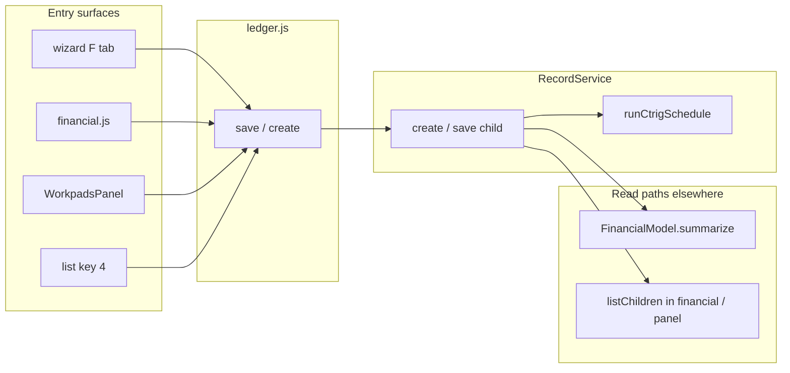

# Audit — `ledger.js` (central financial entry)

**Date:** 2026-05-21  
**LOC:** ~519 · **Shell:** loaded (`index.html`)  
**Verdict:** **keep** — hub screen; tighten picker + align charge labels; do not split file

---

## Role in the app

`LedgerScreen` is the **single write path** for operational child lines:

| UI label | `record_type` | Storage |
|----------|---------------|---------|
| Exp | `expense` | `expense_billing: 'customer'` |
| COGS | `expense` | `expense_billing: 'cogs'` + `charge_type` |
| Inc | `payment` | `record_type: 'payment'` |

Parent link: `parentId` → job/invoice record. Optional `actionIdx`, `activityId`, `linkedContactId`.

**Not responsible for:** AP/AR/loan (`liabilities.js`), job-level amounts (wizard), portfolio totals (`FinancialModel` + `WorkpadsPanel` browse agg).

---

## Entry points (`App.showLedger`)

| Caller | opts | Return |
|--------|------|--------|
| `list.js` key `4` | (none) | List |
| `wizard.js` F tab | `type`, `parentId`, `wizardRecord`, `returnTo: 'wizard'`, `returnFinTab` | Wizard step 4 |
| `wizard.js` | `editRecord`, same return | Wizard F tab |
| `financial.js` | `editRecord`, `returnTo: 'financial'`, `financialRecord` | Financial nav |
| `WorkpadsPanel.js` record panel | `type`, `linkedRecord`, `linkMode: 'record'` | List |
| `WorkpadsPanel.js` contact panel | `type`, `linkedContact`, `linkMode: 'none'` | List |

**Branch:** Worker/vendor contact + Exp/COGS + **Owed** → redirects to `LiabilitiesScreen` (payable), not a ledger save.

---

## Data flow

- **Write:** always `RecordService.create` or `RecordService.save` — good (single choke point).
- **Read:** `financial.js` loads children via `listChildren`; wizard keeps inline expense/payment arrays on `currentRecord` until job save — ledger create writes **directly to storage** (immediate child records).

---

## Architecture strengths

1. **Clear separation** from `liabilities.js` (balance-sheet AP/AR/loan vs job P&L lines).
2. **Return routing** (`returnTo`, `returnFinTab`, `financialRecord`, `wizardRecord`) is explicit — no router hacks.
3. **Edit mode** reuses same form as create (`editRecord`).
4. **Contact panel integration** (`linkedContact`, paid/owed) without duplicating contact CRUD.
5. Uses global `esc` (unlike `liabilities.js` local `esc`).

---

## Issues / smells (ranked)

### 1. `CHARGE_LABELS` mismatch vs `FinancialModel.js` (data integrity)

`ledger.js` uses keys `''`–`'7'` with one label set; `FinancialModel.js` uses `''`–`'14'` with **different meanings** for the same numeric keys (e.g. `'1'` = Materials in ledger, Urgency in FinancialModel; `'6'` = Professional fee vs Materials).

COGS lines saved from ledger display one way in the form and another in finance summaries / wizard groupings.

**Recommendation:** One shared `CHARGE_LABELS` (e.g. in `FinancialModel.js` or `utils.js`) imported by ledger + wizard + panel.

### 2. Duplicate list-row HTML (Wave 3)

`recPickerHtml` + `updateRecPickerList` duplicate the `.list-item` / `.list-item-title` / `.list-item-sub` pattern from `list.js` (~24 lines × 2 code paths). Net shrink via `utils.listRow` still marginal; **dedupe event binding** (re-bind every `updateRecPickerList`) is the bigger cost.

### 3. `RecordService.list()` on every `onShow`

Loads **all** mains for picker even when `linkMode === 'none'` (common for contact quick-add). Defer until `recPickerActive === true` to avoid full-store scan on cold open.

### 4. `filterRecs` — filter + slice

Small list (cap 20); low priority. Could use one pass like `list.filterMainRecords` if picker grows.

### 5. Edit mode drops link context

`editRecord` forces `linkMode = 'none'` and clears `linkedRecord` even when `parentId` is set. User cannot see which job the line belongs to in edit UI (data still has `parentId` on save). **UX gap**, not data loss.

### 6. `todayStr` uses `padStart` with fallback

Fine for KaiOS; `liabilities.js` uses manual padding only — minor inconsistency.

### 7. No `FinancialModel` import

Correct by design: ledger **creates** rows; `FinancialModel` **aggregates**. Keep boundary.

---

## Hot path assessment

| Path | Hot? | Notes |
|------|------|-------|
| Contact quick-add from panel | **Yes** | Often standalone, no picker |
| Wizard F tab add | **Yes** | `parentId` pre-set, no list load needed |
| List key `4` standalone | Medium | Opens full form + background list |
| Edit from financial | Medium | `listChildren` already paid in financial screen |

---

## Shrink / optimize options (ranked)

| Priority | Change | Est. benefit |
|----------|--------|----------------|
| 1 | Unify `CHARGE_LABELS` with `FinancialModel` | Correctness + one constant table |
| 2 | Defer `RecordService.list()` until record picker opens | Fewer reads on common paths |
| 3 | Show linked job title in edit mode when `parentId` set | UX only |
| 4 | `utils.listRow` for picker rows | Small LOC; cleaner binds |
| 5 | Split ledger vs liabilities shared form helper | Only if AP/AR fields converge — not yet |

**Do not:** Remove from shell, split file, or route through wizard-only inline arrays — storage model depends on immediate `create`.

---

## Test coverage

No dedicated ledger screen tests. Indirect: `RecordService`, `FinancialModel`, demo seed child lines, codec expense flags.

Manual smoke: wizard F add/edit, financial Enter on row, panel Out/COGS/Inc, contact owed → liabilities.

---

## Related files to touch together

| File | Relationship |
|------|----------------|
| `financial.js` | Lists/edits same children |
| `wizard.js` | Primary parent context + fin tab |
| `FinancialModel.js` | Summaries COGS/expense/payment |
| `liabilities.js` | Parallel entry UX (payable/receivable/loan) |
| `WorkpadsPanel.js` | Quick create shortcuts |
| `list.js` panel filters | `linkedContactId`, expense_billing |

---

## Next step (if coding)

~~1. Fix **CHARGE_LABELS** alignment~~ **Done** — ledger uses `FinancialModel.CHARGE_LABELS`.  
~~2. Defer **list()** for picker~~ **Done** — `ensureRecordsLoaded()` on picker open only.  
~~3. Edit-mode parent job chip~~ **Done** — read-only parent card when `parentId` + edit or wizard/financial context (view screen unchanged).
