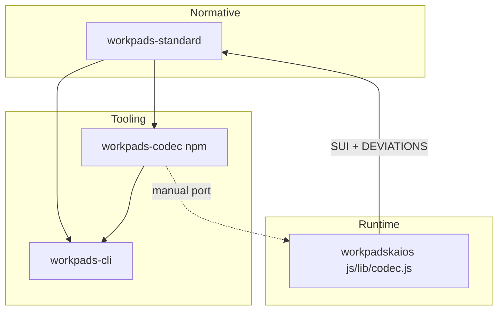

# Workpads Project Process

**Status:** living document — bottleneck for all human and agent work across the four Workpads repos.  
**Owner:** `workpadskaios/system/` (other repos link here).  
**Last updated:** 2026-05-24 (junction Round 0)

---

## 1. Purpose and audience

This file is the **single entry point** before planning, coding, or editing documentation in:

| Repo | Role |
|------|------|
| [workpads-standard](../workpads-standard/) | Normative specification (§1–§8, pads-v1 `codec.md`) |
| [workpads-codec](../workpads-codec/) | `@workpads/codec` — canonical JS encoder for tooling |
| [workpads-cli](../workpads-cli/) | CLI reference + integration harness (§4 + share) |
| [workpadskaios](../) | KaiOS runtime app — primary implementation lab; inlines codec |

If two documents disagree, use the **Authority matrix** (§3) — do not guess.

---

## 2. Dependency graph



**Change order for wire format:** `workpads-standard/codec.md` → `workpads-codec` (tests pass) → port to `workpadskaios/js/lib/codec.js` → run verification (§8).

KaiOS may discover behaviour before the standard documents it — that is normal. It must be **registered** (§6), not left silent.

---

## 3. Authority matrix

| Question | Authority |
|----------|-----------|
| Wire format bits, flags, blocks | `workpads-standard/codec.md` + kaios `dev_refs/FRAME-SPEC.md` (must agree) |
| Cross-repo codec sync checklist | `workpads-standard/codec-sync.md` |
| KaiOS-specific codec notes | `dev_daily/CODEC-SYNC.md` (pointer + kaios-only) |
| App behaviour vs standard | `IMPLEMENTATION.md` + `dev_daily/DEVIATIONS.md` |
| KaiOS UI, ES5, D-pad, storage | `dev_refs/PLATFORM.md`, `dev_refs/WIRING-PATTERNS.md` |
| Service contracts | `dev_refs/TECH-REFERENCE.md` |
| Sprint / phase sequencing | `dev_daily/DEVELOPMENT-PLAN.md`, `ROADMAP.md`, `FEATURES.md` |
| JS file ↔ runtime | `dev_refs/JS-RUNTIME-MAP.md` |
| Shrink posture + pending wire-ups (P1–P4) | `dev_refs/MINIMAL-CODE-AUDIT.md` |
| `node_modules/` meaning | `dev_refs/JS-RUNTIME-MAP.md` § node_modules |
| Standard owes kaios a doc update | `workpads-standard/STANDARD-UPDATES.md` (SUI rows) |
| Open design questions | `dev_daily/OPEN-QUESTIONS.md` |
| Junction / research → kaios plan | `dev_daily/JUNCTION-WORKPLAN.md` |
| Junction Round 0 lock | `dev_daily/JUNCTION-DECISIONS-LOCKED.md` |
| Track A phase execution | `dev_daily/ARCHITECTURE-ALIGNMENT-ROADMAP.md` |
| Research architecture corpus | `research/Main Glyph & Group Ref Docs/` (via Document Index) |

When `record-schema.md` slot tables disagree with `codec.md`, **`codec.md` + `workpads-codec/src/codec.js` win** until the standard is corrected via SUI.

---

## 4. Session start checklist

1. Read **this file** (§7 snapshot for current state).
2. If work touches **research architecture** (Documents 3–13, flags, glyphs, relational compression) → read [`dev_daily/JUNCTION-WORKPLAN.md`](dev_daily/JUNCTION-WORKPLAN.md) first.
3. Read [`dev_daily/DEVELOPMENT-PLAN.md`](dev_daily/DEVELOPMENT-PLAN.md) — current phase.
4. If work is **app screens / UX** (not codec wire): read [`dev_daily/APP-BUILD-PHASE.md`](dev_daily/APP-BUILD-PHASE.md) — inventory + A1–B8 build order.
5. Open the doc for your task domain (see [`system/README.md`](README.md)).
6. If touching records, share URLs, or `js/lib/codec.js` → read [`dev_daily/DEVIATIONS.md`](dev_daily/DEVIATIONS.md).
7. If touching codec wire format → read [`../workpads-standard/codec-sync.md`](../workpads-standard/codec-sync.md) and run §8 verification when done.
8. Log non-trivial code sessions in [`dev_daily/CODING-LOG.md`](dev_daily/CODING-LOG.md).

---

## 5. Change classes and mandatory side effects

| Change type | Must also update |
|-------------|------------------|
| Wire field / flag / block | `codec.md` → SUI in `STANDARD-UPDATES.md` if needed → `workpads-codec` → `workpadskaios/js/lib/codec.js` → `codec-sync` checklist → `npm test` in kaios + codec |
| App-only UX / screen | `APP-BUILD-PHASE.md` (if queued item), `FEATURES.md`, `CODING-LOG.md`; standard only if behaviour is normative |
| KaiOS insight → normative | `OPEN-QUESTIONS.md` resolution + SUI row → standard doc → codec → cli README if user-facing |
| Deviation from standard | `DEVIATIONS.md` immediately; summary in `workpads-standard/implementation-notes.md` |
| New screen | `WIRING-PATTERNS.md` checklist, `app.js` `SCREENS`, `index.html`, `FEATURES.md` |

---

## 6. Insight backflow protocol

```
kaios draft_spec (dev_daily/draft_specs/)
    → dev_refs spec (frozen)
    → SUI row (workpads-standard/STANDARD-UPDATES.md)
    → standard doc published
    → workpads-codec port
    → workpadskaios/js/lib/codec.js port (if not already ahead)
    → workpads-cli / README alignment
```

**Rule:** Implementation ahead of standard is allowed during active development; **SUI + DEVIATIONS** are how we avoid losing it.

---

## 7. State of Total Project (snapshot)

**Snapshot date:** 2026-05-21 (phase audit)

| Component | Version / state | Notes |
|-----------|-----------------|-------|
| workpadskaios app | **0.2.0** (`package.json`, manifest) | 22 screens; phases **A–I complete**, **J/K partial**, **L in progress** |
| workpads-standard | **v0.1** repo; **codec.md v2.0** pads-v1 | SUI-001–020 **done** |
| @workpads/codec | **0.1.0** | ~796 lines; subset of kaios codec |
| workpads-cli | **0.2.0** | Uses `@workpads/codec`; `.wpf` pads-v1 |
| Open deviations (kaios) | **0** blocking | DEV-WP-MFT-001 accepted (store PNG TBD) |
| Phase audit | See `DEVELOPMENT-PLAN.md` table | v0.2 store path = Phase L (+ optional J/K) |
| IMPLEMENTATION gaps | **3+** | `changedMask` at share; `_ratifiedFrame` emission; C-TRIG scheduling |
| kaios `npm test` | **685 pass / 0 fail** (2026-05-21) | `flow.test.js` (39) → npm; `codec-pads-v1.test.js` (646) → inlined codec |
| Codec line drift | kaios 1646 vs npm 796 lines | Files differ; kaios is superset — see §8 port policy |

### Codec copies (pads-v1)

| Copy | Path | Encode | Decode |
|------|------|--------|--------|
| Normative spec | `workpads-standard/codec.md` | spec | spec |
| npm package | `workpads-codec/src/codec.js` | `#1pa/` | `#1pa/` + legacy |
| KaiOS inline | `workpadskaios/js/lib/codec.js` | `#1pa/` (+ `#1pb/` `#1ps/` opts) | pads-v1 + legacy `1eg/`…`1ag/` + query |
| CLI | via `@workpads/codec` | `#1pa/` | same |

**KaiOS superset:** inline codec (~1646 lines) includes security wrapper, presentation tags, and legacy decoders not fully exposed in the npm package. CLI-generated `#1pa/` records must round-trip in kaios; kaios-only tags must be listed in `IMPLEMENTATION.md` until ported.

### Doc health (2026-05-21)

| Item | Status |
|------|--------|
| `project-process.md` | Current (this file) |
| `FEATURES.md` | Shipped vs pending (aligned to `js/` audit 2026-05-21) |
| `dev_refs/JS-RUNTIME-MAP.md` | All `js/` files; index.html load set; node_modules |
| `dev_refs/MINIMAL-CODE-AUDIT.md` | Shrink waves; P1–P4 backlog; per-file scorecard |
| `dev_daily/CODEC-SYNC.md` | Updated for pads-v1 |
| `PRODUCTION-READINESS.md` | Banner + pointer; detail in `FEATURES.md` |
| `workpads-codec/README.md`, `workpads-cli/README.md` | Updated for `#1pa/` |
| `workpads-standard/ECOSYSTEM.md` | Updated scheme tag |

Refresh this §7 table after any cross-repo codec change or release.

---

## 8. Verification

Run from `workpadskaios/`:

```bash
npm test
```

| Test file | Exercises |
|-----------|-----------|
| `test/codec-pads-v1.test.js` | Inlined `js/lib/codec.js` (full kaios pads-v1) |
| `test/flow.test.js` | `@workpads/codec` npm package (interop with CLI) |

From `workpads-codec/`:

```bash
node test/codec.test.js
```

**CLI round-trip (benchmark):**

```bash
cd ../workpads-cli
node ./workpads.js create --job "Interop test" --customer "Test" --date 2026-05-21
node ./workpads.js share <id>
# Paste URL into kaios receive flow or: node -e "require('@workpads/codec').decode('<url>')"
```

### Port policy (codec drift)

1. **Normative** changes land in `workpads-standard` first.
2. **Tooling truth** is `workpads-codec` — CLI and `flow.test.js` depend on it.
3. **KaiOS inline** is ported from npm for shared pads-v1 paths; kaios-only features stay in kaios until classified:
   - **Port to npm** — CLI/tests must exercise it.
   - **Kaios-only** — document in `IMPLEMENTATION.md` (not a deviation if decode-only or optional tag).

Compare sizes periodically:

```bash
wc -l workpadskaios/js/lib/codec.js workpads-codec/src/codec.js
diff -q workpadskaios/js/lib/codec.js workpads-codec/src/codec.js || true
```

---

## 9. Links from sibling repos

- [workpads-standard/README.md](../workpads-standard/README.md) — process entry
- [workpads-codec/README.md](../workpads-codec/README.md) — process entry
- [workpads-cli/README.md](../workpads-cli/README.md) — process entry

---

## 10. Related kaios docs

| File | Use |
|------|-----|
| [`IMPLEMENTATION.md`](../IMPLEMENTATION.md) | Standard ↔ app map |
| [`dev_daily/FEATURES.md`](dev_daily/FEATURES.md) | Feature register (preferred over stale PRODUCTION-READINESS detail) |
| [`dev_daily/DEVIATIONS.md`](dev_daily/DEVIATIONS.md) | Formal deviations |
| [`dev_refs/FRAME-SPEC.md`](dev_refs/FRAME-SPEC.md) | pads-v1 wire reference |
